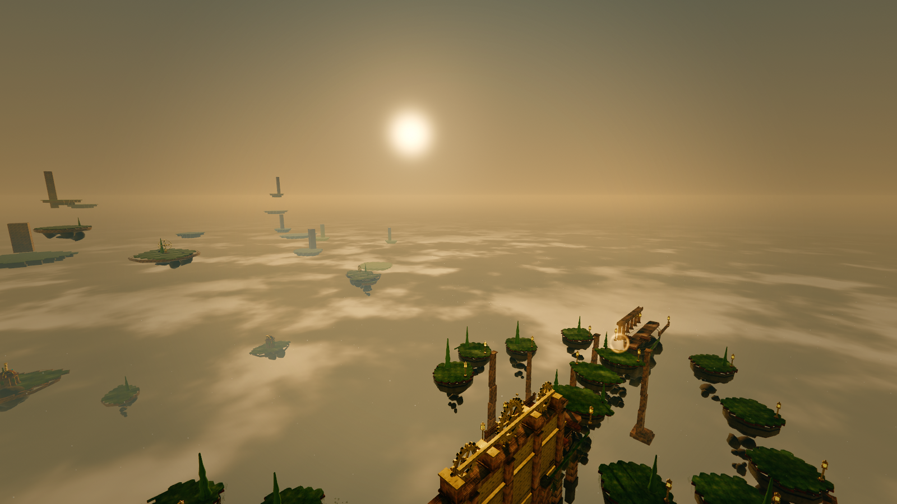
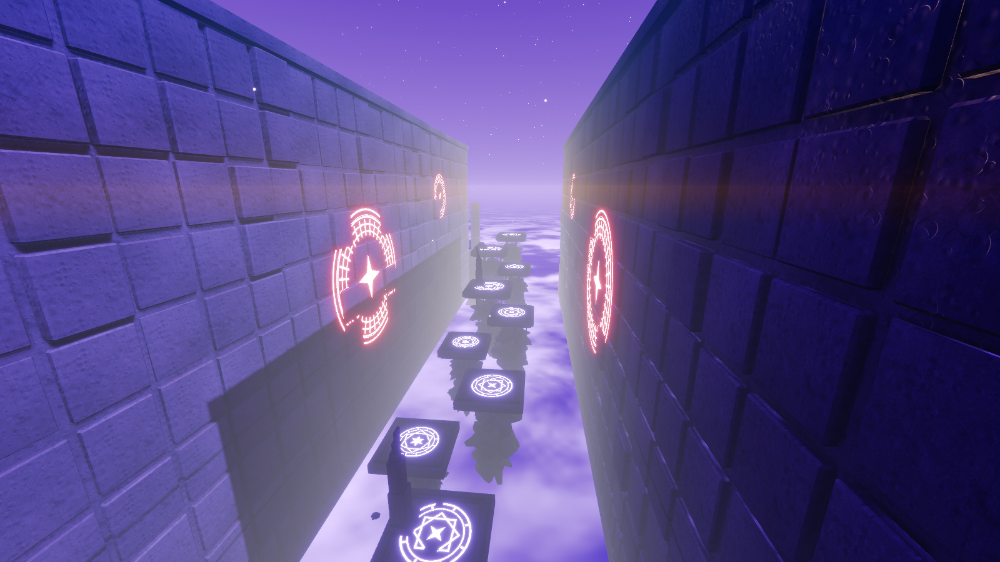

# Skyline Courier

First-person momentum parkour across a floating archipelago. Run, wall-run,
dash, slide, and grapple your way through two themed courses: a sunset skyline
that teaches you the verbs, and a void that assumes you mean it.

**Play it now: [skyline-courier-5329.web.app](https://skyline-courier-5329.web.app)**



## Controls

| Input | Action |
| --- | --- |
| WASD or Arrow keys | Move (switchable in Settings) |
| Mouse | Look (sensitivity slider in Settings) |
| Space | Jump / wall-jump |
| Shift | Sprint |
| Ctrl or C | Slide |
| F | Grapple (hold to swing, release to fly) |
| R | Restart from checkpoint |

Abilities unlock progressively as the course demands them; a returning player
gets the whole set at once.

## Modes

- **Normal**: grapple budget refills on contact. The course is built and
  verified against this mode.
- **Fun**: infinite hook chains, floatier pulls. A playground superset; anything
  reachable in Normal is reachable here.
- **Hardcore**: for people who think checkpoints are for other people.

Per-course leaderboards and records live in the menu.



## How it's built

- **Three.js, and that is the only runtime dependency.** Almost every mesh is
  generated geometry and every texture is a canvas or a shader. The exceptions
  are deliberate and rare: one painted sky dome per theme, one floor decal, and
  the music.
- The level is data plus a kit of procedural primitives; geometry and collision
  come from the same declaration, so a surface you can see at walkable height
  is always solid.
- The course proves itself at load: reachability of every checkpoint, honest
  edge difficulty bands, and grapple-physics feasibility are asserted on the
  shipping code path. A world that fails does not boot.
- A headless verification harness (`tools/`) drives the built game in a real
  browser and measures every shot: luminance percentiles, clipping, draw calls,
  triangles, ms/frame. Changes to the look are judged by measurement, not
  eyeballs.

## Development

```sh
npm install
npm run dev     # local dev server
npm run build   # production build (must be warning-free)
```

Design docs, art direction, and the measured changelog live in [`docs/`](docs/).
